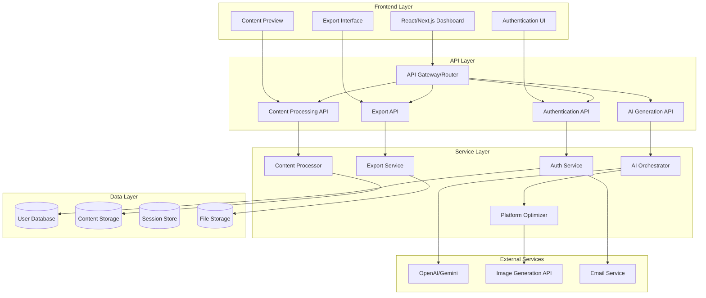

# Design Document: PostMorphAI

## Overview

PostMorphAI is a web-based AI-powered content transformation platform that converts single user inputs into optimized posts for multiple social media platforms. The system leverages modern AI APIs (OpenAI GPT or Gemini) to generate platform-specific content while maintaining a clean, scalable architecture suitable for rapid development and future extensibility.

The platform follows a microservices-inspired architecture with clear separation between authentication, content processing, AI generation, and export functionality. This design enables independent scaling of components and easy integration of additional platforms or AI providers.

## Architecture

### High-Level Architecture



### Technology Stack

**Frontend:**
- React with Next.js for server-side rendering and API routes
- TypeScript for type safety
- Tailwind CSS for styling
- React Query for state management and API caching

**Backend:**
- Node.js with Express.js or Next.js API routes
- TypeScript for consistency
- JWT for authentication
- Prisma ORM for database operations

**Database:**
- PostgreSQL for user data and content metadata
- Redis for session storage and caching
- AWS S3 or similar for file storage

**AI Integration:**
- OpenAI GPT-4 or Anthropic Claude API for content generation
- DALL-E or Midjourney API for image suggestions

## Components and Interfaces

### Authentication Service

**Purpose:** Manages user registration, login, session management, and password reset functionality.

**Key Interfaces:**
```typescript
interface AuthService {
  register(userData: UserRegistrationData): Promise<AuthResult>
  login(credentials: LoginCredentials): Promise<AuthResult>
  logout(sessionId: string): Promise<void>
  resetPassword(email: string): Promise<void>
  validateSession(token: string): Promise<User | null>
}

interface UserRegistrationData {
  email: string
  password: string
  firstName: string
  lastName: string
}

interface LoginCredentials {
  email: string
  password: string
}

interface AuthResult {
  success: boolean
  token?: string
  user?: User
  error?: string
}
```

### Content Processor

**Purpose:** Handles input validation, content preprocessing, and manages the content generation workflow.

**Key Interfaces:**
```typescript
interface ContentProcessor {
  processTextInput(input: TextInput): Promise<ProcessedContent>
  processImageInput(input: ImageInput): Promise<ProcessedContent>
  processVideoIdea(input: VideoIdeaInput): Promise<ProcessedContent>
  validateInput(input: RawInput): ValidationResult
}

interface RawInput {
  type: 'text' | 'image' | 'video_idea'
  content: string | File
  userId: string
}

interface ProcessedContent {
  id: string
  userId: string
  originalInput: RawInput
  processedAt: Date
  status: 'processing' | 'ready' | 'error'
}
```

### AI Orchestrator

**Purpose:** Coordinates AI API calls, manages prompt engineering, and handles AI service failures gracefully.

**Key Interfaces:**
```typescript
interface AIOrchestrator {
  generatePlatformContent(content: ProcessedContent): Promise<GeneratedContent[]>
  regenerateContent(contentId: string, platforms: Platform[]): Promise<GeneratedContent[]>
  getGenerationStatus(jobId: string): Promise<GenerationStatus>
}

interface GeneratedContent {
  id: string
  platform: Platform
  text: string
  hashtags: string[]
  imagePrompts: string[]
  generatedAt: Date
  metadata: PlatformMetadata
}

type Platform = 'instagram' | 'linkedin' | 'twitter' | 'facebook'

interface PlatformMetadata {
  characterCount: number
  hashtagCount: number
  tone: string
  estimatedEngagement: number
}
```

### Platform Optimizer

**Purpose:** Applies platform-specific rules, formatting, and optimization strategies to generated content.

**Key Interfaces:**
```typescript
interface PlatformOptimizer {
  optimizeForPlatform(content: string, platform: Platform): Promise<OptimizedContent>
  validatePlatformRules(content: OptimizedContent): ValidationResult
  generateImageSuggestions(content: OptimizedContent): Promise<ImageSuggestion[]>
}

interface OptimizedContent {
  platform: Platform
  text: string
  hashtags: string[]
  characterCount: number
  tone: string
  callToAction?: string
  imageRequirements: ImageRequirements
}

interface PlatformRules {
  maxCharacters: number
  maxHashtags: number
  toneGuidelines: string[]
  formatRequirements: string[]
  imageSpecs: ImageSpecs
}

// Platform-specific rules based on research
const PLATFORM_RULES: Record<Platform, PlatformRules> = {
  instagram: {
    maxCharacters: 2200,
    maxHashtags: 30,
    toneGuidelines: ['visual-first', 'casual', 'engaging'],
    formatRequirements: ['hook-first-125-chars', 'emoji-friendly'],
    imageSpecs: { aspectRatio: '1:1', minWidth: 1080 }
  },
  linkedin: {
    maxCharacters: 3000,
    maxHashtags: 5,
    toneGuidelines: ['professional', 'thought-leadership', 'value-driven'],
    formatRequirements: ['business-focused', 'discussion-starter'],
    imageSpecs: { aspectRatio: '1.91:1', minWidth: 1200 }
  },
  twitter: {
    maxCharacters: 280,
    maxHashtags: 3,
    toneGuidelines: ['concise', 'conversational', 'trending'],
    formatRequirements: ['thread-ready', 'retweet-optimized'],
    imageSpecs: { aspectRatio: '16:9', minWidth: 1024 }
  },
  facebook: {
    maxCharacters: 63206,
    maxHashtags: 10,
    toneGuidelines: ['community-focused', 'shareable', 'engaging'],
    formatRequirements: ['algorithm-friendly', 'discussion-starter'],
    imageSpecs: { aspectRatio: '1.91:1', minWidth: 1200 }
  }
}
```

### Export Service

**Purpose:** Handles content packaging, file generation, and download management for generated posts.

**Key Interfaces:**
```typescript
interface ExportService {
  createExportPackage(contentIds: string[], platforms: Platform[]): Promise<ExportPackage>
  generateDownloadLink(packageId: string): Promise<string>
  cleanupExpiredPackages(): Promise<void>
}

interface ExportPackage {
  id: string
  userId: string
  platforms: Platform[]
  files: ExportFile[]
  createdAt: Date
  expiresAt: Date
  downloadUrl: string
}

interface ExportFile {
  platform: Platform
  type: 'text' | 'image'
  filename: string
  content: string | Buffer
  mimeType: string
}
```

## Data Models

### User Model
```typescript
interface User {
  id: string
  email: string
  firstName: string
  lastName: string
  passwordHash: string
  createdAt: Date
  updatedAt: Date
  isActive: boolean
  subscriptionTier: 'free' | 'premium'
}
```

### Content Session Model
```typescript
interface ContentSession {
  id: string
  userId: string
  originalInput: RawInput
  generatedContent: GeneratedContent[]
  status: 'processing' | 'completed' | 'failed'
  createdAt: Date
  updatedAt: Date
  expiresAt: Date
}
```

### Generation Job Model
```typescript
interface GenerationJob {
  id: string
  sessionId: string
  platform: Platform
  status: 'queued' | 'processing' | 'completed' | 'failed'
  aiProvider: 'openai' | 'anthropic'
  promptUsed: string
  tokensUsed: number
  generatedAt?: Date
  error?: string
}
```

Now I need to use the prework tool to analyze the acceptance criteria before writing the Correctness Properties section:

## Correctness Properties

*A property is a characteristic or behavior that should hold true across all valid executions of a system—essentially, a formal statement about what the system should do. Properties serve as the bridge between human-readable specifications and machine-verifiable correctness guarantees.*

Based on the prework analysis, I've identified several logically redundant properties that can be consolidated:

**Property Reflection:**
- Properties 4.1-4.4 (platform-specific optimization) can be combined into a single comprehensive property about platform rule compliance
- Properties 5.1-5.4 (preview functionality) can be consolidated into properties about preview completeness and accuracy
- Properties 6.1-6.3 (export functionality) can be combined into comprehensive export properties
- Authentication properties 1.1-1.5 represent distinct behaviors and should remain separate
- Content processing properties 2.1-2.5 cover different input types and validation scenarios, should remain separate

### Property 1: User Registration Round Trip
*For any* valid user registration data, creating an account and then logging in with those credentials should result in successful authentication and dashboard access.
**Validates: Requirements 1.1, 1.2**

### Property 2: Invalid Authentication Rejection
*For any* invalid login credentials (wrong password, non-existent email, malformed input), the system should reject the authentication attempt and return appropriate error messages.
**Validates: Requirements 1.3**

### Property 3: Session Management Consistency
*For any* authenticated user session, logout should completely terminate the session such that subsequent requests with that session token are rejected.
**Validates: Requirements 1.4**

### Property 4: Password Reset Delivery
*For any* registered user email address, requesting password reset should generate and deliver a secure reset link to that email address.
**Validates: Requirements 1.5**

### Property 5: Content Input Processing
*For any* valid content input (text, image, or video idea), the system should accept and store the input for processing without errors.
**Validates: Requirements 2.1, 2.2, 2.3**

### Property 6: Input Validation Rejection
*For any* invalid content input (empty, oversized, malformed), the system should reject the input and provide specific validation error messages.
**Validates: Requirements 2.4, 2.5**

### Property 7: Multi-Platform Content Generation
*For any* valid raw content input, the content generator should produce optimized posts for all four target platforms (Instagram, LinkedIn, Twitter/X, Facebook).
**Validates: Requirements 3.1**

### Property 8: Platform Rule Compliance
*For any* generated post, the content should comply with the target platform's character limits, hashtag requirements, and formatting rules as defined in PLATFORM_RULES.
**Validates: Requirements 3.2, 4.1, 4.2, 4.3, 4.4**

### Property 9: Content Storage Association
*For any* completed content generation session, all generated posts should be stored and correctly associated with the user's session for later retrieval.
**Validates: Requirements 3.3**

### Property 10: AI Service Error Handling
*For any* AI service failure or timeout, the system should display appropriate error messages and maintain the ability to retry the operation.
**Validates: Requirements 3.4**

### Property 11: Preview Completeness
*For any* completed content generation, the dashboard should display previews for all generated posts with platform-specific formatting and suggested images.
**Validates: Requirements 5.1, 5.2**

### Property 12: Preview Detail Accuracy
*For any* platform preview selection, the detailed view should display the complete post content exactly as it would appear on that platform.
**Validates: Requirements 5.3, 5.4**

### Property 13: Content Regeneration Consistency
*For any* content input, regenerating posts should produce new content while maintaining the same platform optimization rules and input association.
**Validates: Requirements 5.5**

### Property 14: Export Package Completeness
*For any* export request with selected platforms, the system should create export packages containing both text content and suggested images for each requested platform.
**Validates: Requirements 6.1, 6.2**

### Property 15: Export Format Compliance
*For any* export package, the downloaded files should be in formats appropriate for their target platforms and remain accessible for the specified retention period.
**Validates: Requirements 6.3, 6.4**

### Property 16: Usage Tracking Consistency
*For any* download event, the system should log the usage data for analytics while maintaining user privacy and data protection standards.
**Validates: Requirements 6.5**

### Property 17: Error Recovery and Logging
*For any* system error or exception, the system should log the incident details and recover gracefully without losing user data or session state.
**Validates: Requirements 7.5**

### Property 18: Data Storage Security
*For any* user content (raw input or generated posts), the system should store the data securely with appropriate encryption and access controls.
**Validates: Requirements 8.1, 8.2**

### Property 19: Backup Data Integrity
*For any* system backup operation, the backed-up data should maintain complete integrity and be recoverable to the exact state at backup time.
**Validates: Requirements 8.5**

## Error Handling

### AI Service Failures
- **Timeout Handling**: Implement exponential backoff for AI API calls with maximum retry limits
- **Rate Limiting**: Handle API rate limits gracefully with queuing and user notification
- **Fallback Strategies**: Maintain multiple AI provider configurations for redundancy
- **Partial Failure Recovery**: Allow regeneration of individual platform posts if others succeed

### Input Validation Errors
- **File Upload Failures**: Validate file types, sizes, and formats before processing
- **Content Sanitization**: Clean and validate all user inputs to prevent injection attacks
- **Graceful Degradation**: Provide meaningful error messages for all validation failures

### System Resource Management
- **Memory Management**: Implement proper cleanup for large file uploads and AI responses
- **Storage Limits**: Monitor and enforce user storage quotas with clear notifications
- **Database Connection Handling**: Implement connection pooling and retry logic for database operations

### User Experience Error Handling
- **Progress Indication**: Show clear progress during long-running operations
- **Error Recovery**: Provide clear paths for users to recover from errors
- **Data Persistence**: Maintain user work during temporary failures

## Testing Strategy

### Dual Testing Approach

The testing strategy employs both unit testing and property-based testing as complementary approaches:

**Unit Tests** focus on:
- Specific examples and edge cases for each component
- Integration points between services
- Error conditions and boundary cases
- Authentication flows and session management
- File upload and validation scenarios

**Property-Based Tests** focus on:
- Universal properties that hold across all valid inputs
- Comprehensive input coverage through randomization
- Platform rule compliance across generated content
- Data integrity and consistency properties
- Round-trip operations (generation → storage → retrieval)

### Property-Based Testing Configuration

**Framework Selection**: Use `fast-check` for JavaScript/TypeScript property-based testing, providing excellent integration with Jest and comprehensive generator libraries.

**Test Configuration**:
- Minimum 100 iterations per property test to ensure statistical confidence
- Custom generators for user data, content inputs, and platform-specific data
- Shrinking capabilities to find minimal failing examples
- Deterministic seeding for reproducible test runs

**Property Test Tagging**:
Each property-based test must include a comment referencing its design document property:
```typescript
// Feature: postmorph-ai, Property 1: User Registration Round Trip
// Feature: postmorph-ai, Property 8: Platform Rule Compliance
```

### Integration Testing

**API Integration Tests**:
- End-to-end workflows from content input to export
- AI service integration with mock and real API calls
- Database transaction integrity
- File storage and retrieval operations

**Performance Testing**:
- Load testing for concurrent user scenarios
- AI API response time monitoring
- Database query performance validation
- File upload and processing benchmarks

### Test Data Management

**Synthetic Data Generation**:
- Realistic user profiles and content for testing
- Platform-specific content that exercises edge cases
- Large file uploads for performance testing
- Invalid inputs for validation testing

**Test Environment Isolation**:
- Separate test databases and storage
- Mock AI services for deterministic testing
- Isolated user sessions and authentication
- Clean test data between test runs